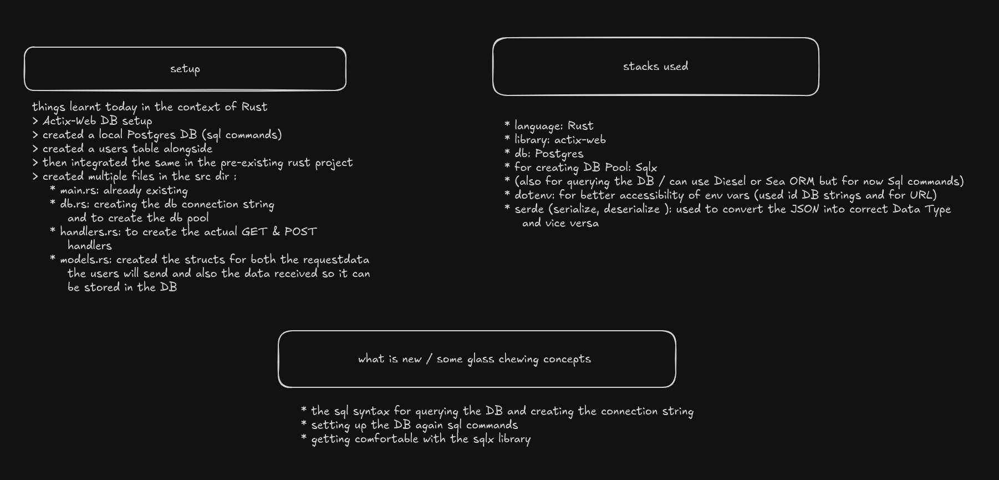

# Rust + Actix-Web + PostgreSQL Starter

A fast and modular backend project built with **Rust**, using the **Actix-Web** framework and **PostgreSQL** as the database.

> This project is under active development and will include features such as authentication, Docker support, deployment, and a frontend in the future.

---

## 🚀 Tech Stack

- **Rust**
- **Actix-Web** - Fast and powerful web framework
- **SQLx** - Async, compile-time verified SQL queries
- **PostgreSQL** - Relational database
- **dotenv** - Environment configuration

---

## 📦 Setup Instructions

### 1. Clone the Repo

```bash
git clone <your-repo-url>
cd rust-actix-postgres
```

### 2. Create and Configure the `.env` File

```env
SERVER_ADDR=127.0.0.1:8080
PG__USER=test_user
PG__PASSWORD=testing
PG__HOST=127.0.0.1
PG__PORT=5432
PG__DBNAME=testing_db
PG__POOL_MAX_SIZE=16
```

### 3. Database Setup

Run the following from your shell:

```bash
# Switch to postgres user
sudo -u postgres psql

# Inside the psql shell
CREATE USER test_user WITH PASSWORD 'testing';
CREATE DATABASE testing_db OWNER test_user;
```

(Optional) Load schema if available:

```bash
psql -U test_user -d testing_db -f sql/schema.sql
```

---

### 4. Grant Access to Users

1. **Switch to the PostgreSQL shell as your created user:**

```bash
sudo -u postgres psql -U test_user -d testing_db -h 127.0.0.1 -W
```

2. **Inside the PostgreSQL shell, execute the following commands:**

- **Grant access to the `public` schema:**

```sql
GRANT ALL PRIVILEGES ON SCHEMA public TO test_user;
```

- **Allow `UPDATE`, `DELETE`, `INSERT`, and `SELECT` operations on all tables:**

```sql
GRANT ALL PRIVILEGES ON ALL TABLES IN SCHEMA public TO test_user;
```

- **Grant access to all sequences in the schema:**

```sql
GRANT ALL PRIVILEGES ON ALL SEQUENCES IN SCHEMA public TO test_user;
```
```

## 💻 Running the Server

Make sure you have the required crates installed in `Cargo.toml`, then:

```bash
cargo run
```

Server will run at: [http://127.0.0.1:8080](http://127.0.0.1:8080)

---

## 🧪 Sample Endpoints

### Create User

```bash
curl -i -d '{
  "email": "ferris@thecrab.com",
  "first_name": "Ferris",
  "last_name": "Crab",
  "username": "ferreal"
}' -H "Content-Type: application/json" http://127.0.0.1:8080/users
```

### Get All Users

```bash
curl http://127.0.0.1:8080/get-users
```

---

## 🛠️ Roadmap

- [x] Setup Actix server and DB pool
- [x] Add POST & GET endpoints for `users`
- [ ] Implement Authentication & JWT
- [ ] Add logging and error handling middleware
- [ ] Switch to a cloud-hosted PostgreSQL DB
- [ ] Dockerize the backend
- [ ] Add a frontend (likely React or Svelte)
- [ ] Deploy backend & frontend (e.g., Fly.io, Railway, Netlify)
- 
---

## 📝 License

MIT — feel free to use and adapt.

---

## 🙌 Acknowledgments

- [Actix Web](https://actix.rs/)
- [SQLx](https://docs.rs/sqlx)
- [Rust Language](https://www.rust-lang.org/)# rust-proj